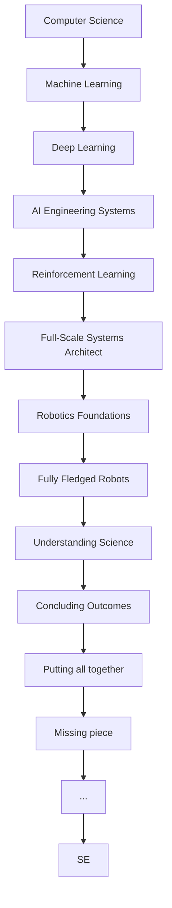

# SE

**Job Title:** AI Engineer

**Job Duration:** 1 Jan 2027 - Present

**Process:**

---
Believe In Yourself  
You can do it.  
Let's meet me at the ship  
Keep Going.  
I am a Monster, I will only hurt her, keep away, if you truly love her.  

# IITM

1. week_n Recorded Lectures
2. week_n Live Lectures.
3. week_n practice Assignments.
4. week_n graded assignments.

# ML Engineer Roadmap

1. Foundation
   1. Mathematics
   2. Statistics
   3. Python
2. Advanced
   1. DSA
   2. Java
   3. System commands
3. Machine Learning
   1. MLF
   2. MLT
   3. MLP
4. Deep Learning
   1. DL_GenAI
   2. AI: Search methods
   3. Deep Learning Core
   4. Intro to Big Data
   5. Advanced Algo
   6. Data Science and AI Llab
   7. ADS
5. LLM
   1. intro to LLM
6. NLP
   1. i-NLP
7. CV
   1. DL for CV
8. GenAI
   1. Mathematical Foundation of GEnAI
9. Reinforcement Learning
10. MLOps
11. Sequential Decision Making

# SE

## 