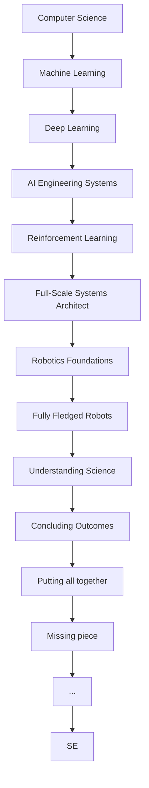

# SE

**Job Title:** AI Engineer

**Job Duration:** 1 Jan 2027 - Present

**Process:**

---
Believe In Yourself  
You can do it.  
Let's meet me at the ship  
Keep Going.  
I am a Monster, I will only hurt her, keep away, if you truly love her.  

# Time table

1. Study IITM just for exams.
2. Study separate for Building Robots.

# My Study
1. Machine Learning
2. Deep Learning
3. Computer Vision
4. Natural Language Processing.

Several Projects.

First cover all these topics then we will discuss.
